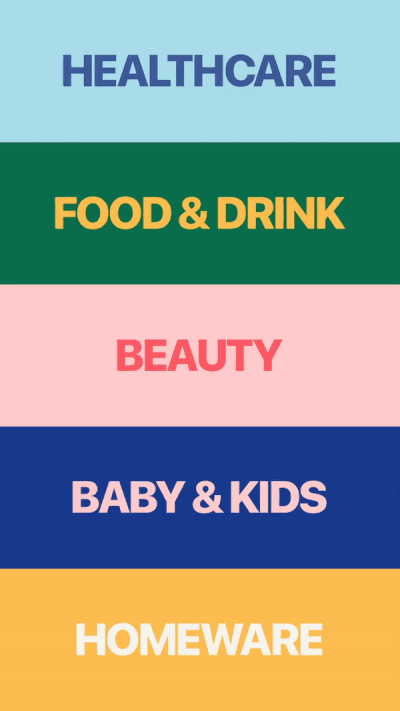

# React Native Accordion Menu

# Run on your device

Snack: https://snack.expo.io/@catalinmiron/react-native-accordion-menu

### Youtube tutorial

In this video tutorial we'll learn how to create an accordion animation in React Native using Transition API from React Native Reanimated library (https://github.com/software-mansion/react-native-reanimated) and flexbox styling.
We will re-create an awesome and colourful animation done by InterfaceMarket.

- Inspiration: https://interfacemarket.com/ui-kits/boston-grocery-delivery-app-ui-kit
- GitHub: https://github.com/catalinmiron/react-native-accordion-menu
- Reanimated: https://github.com/software-mansion/react-native-reanimated
- Expo: https://expo.io/

You can find me on:

- Github: http://github.com/catalinmiron
- Twitter: http://twitter.com/mironcatalin

Wanna give me a coffe?

- Paypal: mironcatalin@gmail.com

In this video tutorial we'll learn how to create an accordion animation in React Native using Transition API from React Native Reanimated library (https://github.com/software-mansion/react-native-reanimated) and flexbox styling.
We will re-create an awesome and colourful animation done by InterfaceMarket.

Inspiration: https://interfacemarket.com/ui-kits/boston-grocery-delivery-app-ui-kit
GitHub: https://github.com/catalinmiron/react-native-accordion-menu
Reanimated: https://github.com/software-mansion/react-native-reanimated
